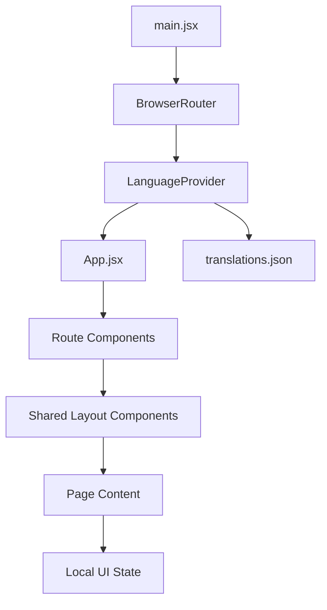
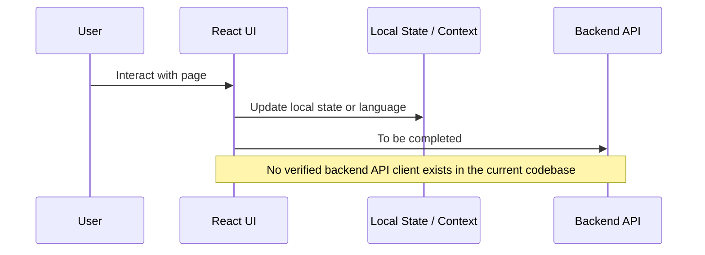
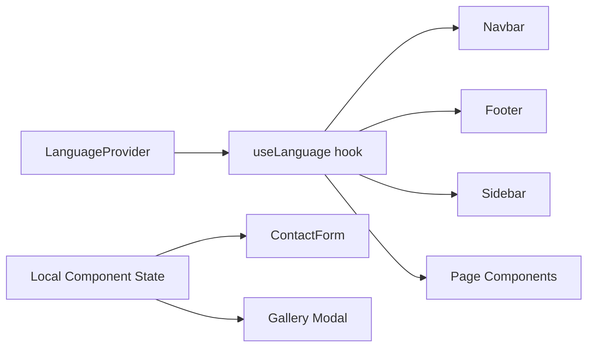
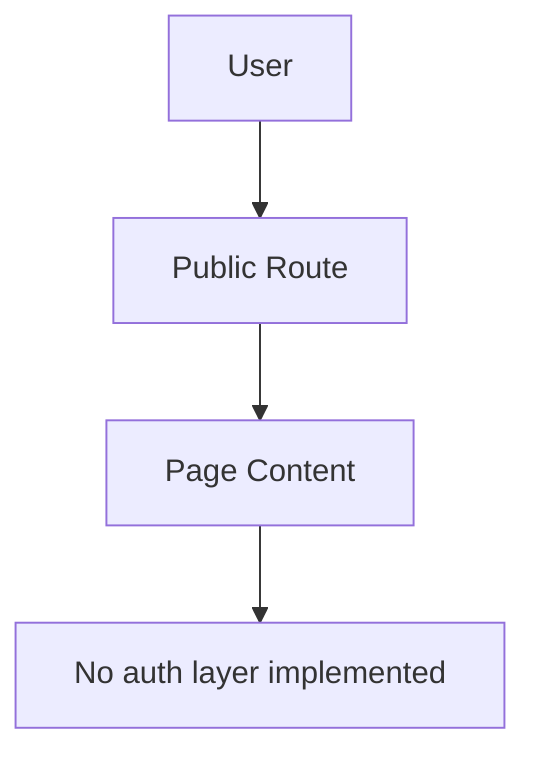

# Arada Sub-city Administration Frontend

[](#)
[](#)
[](#)
[](#)

Public bilingual React frontend for Arada Sub-city Administration.

## Table of Contents

- [Overview](#overview)
- [Live Demo](#live-demo)
- [Features](#features)
- [Tech Stack](#tech-stack)
- [Project Structure](#project-structure)
- [Application Architecture](#application-architecture)
- [Getting Started](#getting-started)
- [Environment Variables](#environment-variables)
- [Available Scripts](#available-scripts)
- [Routing](#routing)
- [API Integration](#api-integration)
- [State Management](#state-management)
- [Authentication](#authentication)
- [UI Components](#ui-components)
- [Responsive Design](#responsive-design)
- [Error Handling](#error-handling)
- [Performance Optimizations](#performance-optimizations)
- [Testing](#testing)
- [Build & Deployment](#build--deployment)
- [Contributing](#contributing)
- [Roadmap](#roadmap)
- [License](#license)
- [Author](#author)

## Overview

This repository contains the frontend application for Arada Sub-city Administration. It is a public information site that presents administration details, leadership content, announcements, a photo gallery, contact information, and a simple woreda page in Amharic and English.

The primary users are citizens, job seekers, visitors, and anyone looking for office information or contact details. The application currently behaves as a mostly static, client-rendered frontend. It does not contain a verified backend API client, authentication system, or admin dashboard in the current codebase.

Backend interaction is **to be completed**. The only external integrations currently verified are the embedded Google Maps view on the contact page and local file downloads from the public assets folder.

## Live Demo

| Item            | URL                                                     |
| --------------- | ------------------------------------------------------- |
| Frontend URL    | https://arada-sub-city-labor-and-skills-off.vercel.app/ |
| Backend API URL | To be completed                                         |

## Features

### Navigation

- Responsive top navigation with office branding and logo assets.
- Bilingual navigation labels for Amharic and English.
- Sticky primary navigation bar with in-page scrolling support from shared links.
- Language toggle that persists the selected language in `localStorage`.

### Content Pages

- Home page with a hero banner, leadership cards, and embedded office videos.
- About page with vision, mission, and values content driven from translations.
- Announcements page with a downloadable document resource and empty-state fallback.
- Contact page with contact cards, a form, and an embedded Google Map.
- Gallery page with a responsive image grid and lightbox-style modal viewer.
- Woreda page with a simple informational placeholder layout.
- Not-found page for unmatched routes.

### Forms & Validation

- Contact form with local component state.
- Required-field validation for name, email, and message.
- Inline validation error message when required fields are missing.
- Form reset after a successful local submission.

### Responsive Design

- Mobile-first layout built with Tailwind CSS utility classes.
- Responsive grids and stacked layouts across small, medium, large, and extra-large screens.
- Full-width map section and gallery modal that adapt to viewport size.

### Other Implemented Features

- Language-aware document title and HTML `lang` updates.
- Persistent language selection between sessions.
- Animated page entry using a custom fade-up utility.
- Gallery modal close behavior with the Escape key.
- Lazy loading for gallery images and the Google Maps iframe.
- Local asset-based content including images, videos, and downloadable documents.

## Tech Stack

### Frontend

- React 19
- Vite
- JavaScript

### Styling

- Tailwind CSS

### Routing

- React Router

### State Management

- Context API

### Validation

- Custom client-side validation

### UI Libraries

- React Icons

### Development Tools

- ESLint
- Vite React plugin
- Tailwind Vite plugin

## Project Structure

```text
frontend/
├── public/
├── src/
│   ├── assets/
│   │   ├── Images/
│   │   └── videos/
│   ├── components/
│   │   ├── contact/
│   │   ├── Footer.jsx
│   │   ├── Navbar.jsx
│   │   ├── PageLayout.jsx
│   │   └── Sidebar.jsx
│   ├── constants/
│   │   └── contactData.js
│   ├── context/
│   │   └── LanguageContext.jsx
│   ├── pages/
│   │   ├── About.jsx
│   │   ├── Announcements.jsx
│   │   ├── Contact.jsx
│   │   ├── Gallery.jsx
│   │   ├── Home.jsx
│   │   ├── NotFound.jsx
│   │   └── Woreda.jsx
│   ├── App.jsx
│   ├── index.css
│   ├── main.jsx
│   └── translations.json
├── tailwind.config.js
├── vite.config.js
└── vercel.json
```

### Folder Purpose

- `src/assets/`: Local static assets used by the UI, including images and videos.
- `src/components/`: Shared layout and section components reused across pages.
- `src/components/contact/`: Contact-page-specific reusable UI pieces.
- `src/constants/`: Static content maps and structured UI data.
- `src/context/`: Application-wide React context providers and hooks.
- `src/pages/`: Route-level page components.
- `src/translations.json`: Amharic and English content source for the interface.
- `src/index.css`: Global styles, font setup, and custom utilities.

## Application Architecture



The application uses a simple route-driven architecture. `main.jsx` mounts the app inside `BrowserRouter` and `LanguageProvider`. `App.jsx` defines the page routes, and each page composes shared layout components such as the navbar, footer, page layout wrapper, and sidebar.

State is intentionally lightweight. Global state is limited to language selection, while each page or section manages its own local UI state when needed.

## Getting Started

### 1. Clone the repository

```bash
git clone https://github.com/Sumeya6/Arada-SubCity-Labor-and-Skills-office.git
cd Arada-SubCity-Labor-and-Skills-office/frontend
```

### 2. Install dependencies

```bash
npm install
```

### 3. Configure environment variables

No frontend environment variables are currently detected in this codebase. If variables are introduced later, add them to a local `.env` file and document them below.

### 4. Start the development server

```bash
npm run dev
```

## Environment Variables

No frontend environment variables were detected in the current codebase.

| Variable        | Description                                      | Required |
| --------------- | ------------------------------------------------ | -------- |
| To be completed | No verified frontend environment variables found | No       |

## Available Scripts

| Script    | Command           | Description                            |
| --------- | ----------------- | -------------------------------------- |
| `dev`     | `npm run dev`     | Starts the Vite development server.    |
| `build`   | `npm run build`   | Creates a production build in `dist/`. |
| `preview` | `npm run preview` | Serves the production build locally.   |
| `lint`    | `npm run lint`    | Runs ESLint across the project.        |

## Routing

| Route            | Component       | Public/Protected | Description                                                   |
| ---------------- | --------------- | ---------------- | ------------------------------------------------------------- |
| `/`              | `Home`          | Public           | Landing page with hero content, leadership cards, and videos. |
| `/about`         | `About`         | Public           | Vision, mission, and values content.                          |
| `/announcements` | `Announcements` | Public           | Announcement resources and local document download action.    |
| `/contact`       | `Contact`       | Public           | Contact information, message form, and map embed.             |
| `/gallery`       | `Gallery`       | Public           | Image gallery with modal preview.                             |
| `/woreda`        | `Woreda`        | Public           | Basic woreda information page.                                |
| `*`              | `NotFound`      | Public           | Fallback page for unknown routes.                             |

No protected routes are implemented in the current frontend.

## API Integration



There is no verified API client in the current frontend. No `fetch`, Axios instance, authentication header handling, request interceptor, or token flow is present in the codebase.

The only verified external request-like integrations are the Google Maps iframe on the contact page and browser-triggered downloads for local document assets in the announcements page.

## State Management



Global state is managed through the `LanguageContext` provider. It stores the active language, persists it in `localStorage`, updates the document title, and exposes translation helpers to the rest of the app.

Local state is used for page-specific interactions such as the contact form fields, validation error message, and the gallery modal selection.

No Redux store, React Query cache, or other global client state library is configured.

## Authentication



Authentication is **not implemented** in the current frontend. There are no login, register, logout, refresh token, protected route, or session persistence flows in the verified code.

## UI Components

### Layout and Navigation

- `Navbar.jsx`: Branding header, language toggle, and primary navigation.
- `Footer.jsx`: Office summary, contact details, and footer links.
- `PageLayout.jsx`: Shared page shell that places main content beside the sidebar.
- `Sidebar.jsx`: Search box mockup and office profile panel.

### Contact Section

- `ContactHero.jsx`: Contact banner image section.
- `ContactInfo.jsx`: Contact information card grid.
- `ContactCard.jsx`: Individual contact information card.
- `ContactForm.jsx`: Client-side contact form.
- `ContactMap.jsx`: Embedded Google Maps section and location card.

### Page-Level Primitives

- `LeaderCard`: Leadership profile card used on the home page.
- `VideoFrame`: Local video player wrapper used on the home page.
- Gallery modal overlay: Full-screen image preview on the gallery page.

## Responsive Design

The frontend uses Tailwind CSS utility classes with the default responsive breakpoints (`sm`, `md`, `lg`, and `xl`). Layouts shift from single-column stacks on small screens to multi-column arrangements on larger screens.

Mobile behavior is handled through stacked sections, horizontal overflow control in navigation, and full-width cards. Tablet and desktop layouts expand into grids for leadership content, contact cards, and the gallery.

No custom breakpoint system is defined in the current Tailwind configuration.

## Error Handling

- Contact form validation shows an inline error when required fields are missing.
- The announcements page renders an empty state when no announcements are available.
- The gallery modal can be closed with the Escape key or by clicking the backdrop.
- A dedicated 404 page handles unknown routes.

There is no verified global error boundary, API error handling layer, or loading skeleton system in the current codebase.

## Performance Optimizations

- Gallery images use native lazy loading.
- The Google Maps iframe uses `loading="lazy"`.
- The language provider memoizes its context value with `useMemo`.
- The gallery page memoizes its close handler with `useCallback`.
- Static content is split across route-level pages, so only the selected page renders at a time.

No verified code splitting, virtualization, debounce logic, or image optimization pipeline is implemented.

## Testing

Automated frontend tests are not configured in the current codebase.

There is no verified `test` script in `package.json`, and no Jest, Vitest, React Testing Library, Cypress, or Playwright setup was detected.

## Build & Deployment

The frontend is built with Vite.

```bash
npm run build
```

This produces a production-ready static build in `dist/`. The repository includes Vercel rewrite configuration so client-side routes resolve correctly when deployed as a single-page application.

Deployment-related configuration is currently set up for Vercel. No other hosting platform is verified in the codebase.

## Contributing

1. Create a feature branch.
2. Make focused changes.
3. Run `npm run lint` and, if added later, the project test suite.
4. Verify the UI in the browser.
5. Open a pull request with a clear summary and screenshots when relevant.

Please keep changes aligned with the verified architecture and avoid introducing undocumented dependencies or assumptions.

## Roadmap

- Connect the contact form to a real backend endpoint.
- Add a formal validation library if form complexity grows.
- Introduce an automated frontend test suite.
- Replace placeholder or static content with CMS- or API-driven content where needed.
- Add authenticated admin or staff workflows only if they are required by the product scope.
- Complete missing frontend environment-variable documentation if runtime configuration is introduced.

## License

MIT License placeholder.

No license file was detected in the current codebase.
